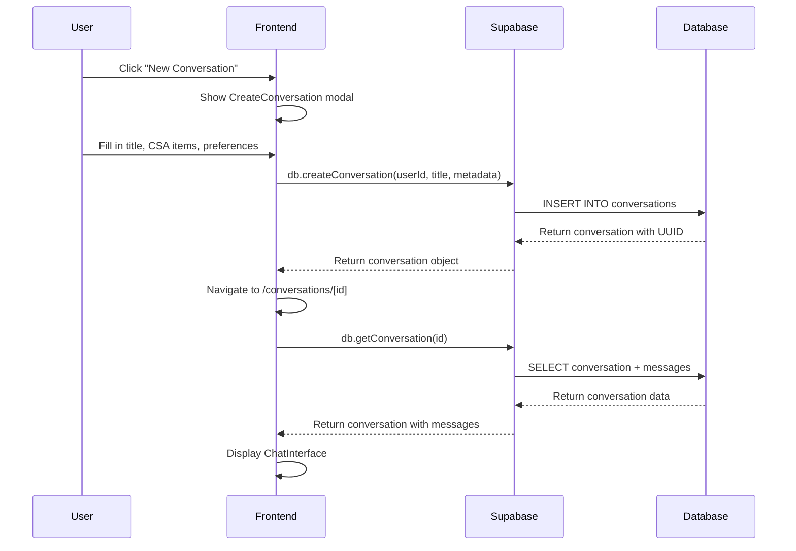
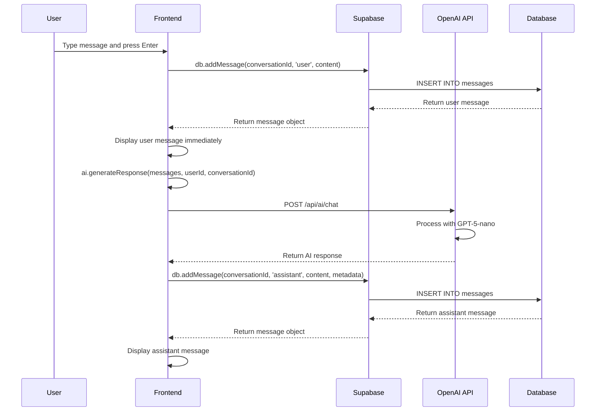
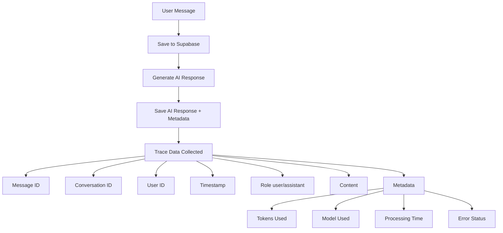
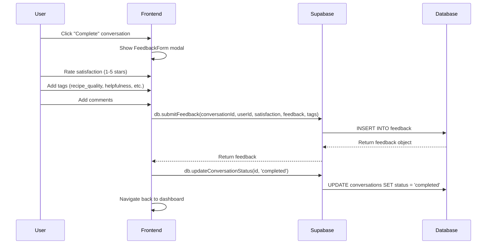

# Chef Chopski Architecture

## System Overview

Chef Chopski is a frontend-only application that provides AI-powered meal planning with comprehensive conversation monitoring and evaluation capabilities.

```
┌─────────────────────────────────────────────────────────────────────────────┐
│                              Chef Chopski Architecture                     │
├─────────────────────────────────────────────────────────────────────────────┤
│                                                                             │
│  ┌─────────────────┐    ┌─────────────────┐    ┌─────────────────┐        │
│  │   Frontend      │    │   Supabase      │    │   OpenAI        │        │
│  │   (Next.js)     │    │   (Database)    │    │   (AI Service)   │        │
│  └─────────────────┘    └─────────────────┘    └─────────────────┘        │
│           │                       │                       │                 │
│           └───────────────────────┼───────────────────────┘                 │
│                                   │                                       │
└───────────────────────────────────┼───────────────────────────────────────┘
                                    │
                                    ▼
```

## Detailed Flow Diagrams

### 1. Creating a New Conversation



### 2. Sending and Receiving Messages



### 3. Trace Collection and Metadata



### 4. Feedback and Evaluation Flow



## Data Model

### Database Schema (Supabase)

```sql
-- Conversations table
conversations (
  id UUID PRIMARY KEY,
  user_id VARCHAR(255),
  title VARCHAR(500),
  created_at TIMESTAMP,
  updated_at TIMESTAMP,
  status VARCHAR(50), -- 'active', 'completed', 'archived'
  metadata JSONB -- CSA items, dietary preferences, meal count, prep time
)

-- Messages table
messages (
  id UUID PRIMARY KEY,
  conversation_id UUID REFERENCES conversations(id),
  role VARCHAR(50), -- 'user' or 'assistant'
  content TEXT,
  timestamp TIMESTAMP,
  metadata JSONB -- tokens, model, processing time, errors
)

-- Feedback table
feedback (
  id UUID PRIMARY KEY,
  conversation_id UUID REFERENCES conversations(id),
  user_id VARCHAR(255),
  satisfaction INTEGER, -- 1-5 scale
  feedback TEXT,
  created_at TIMESTAMP,
  tags TEXT[] -- ['recipe_quality', 'response_time', 'helpfulness']
)
```

## Key Components

### Frontend Structure
```
frontend/
├── app/
│   ├── page.tsx                    # Dashboard
│   ├── conversations/[id]/page.tsx # Conversation view
│   └── api/ai/chat/route.ts        # OpenAI API proxy
├── components/
│   ├── ConversationList.tsx        # List all conversations
│   ├── CreateConversation.tsx      # New conversation modal
│   ├── ChatInterface.tsx           # Message interface
│   ├── FeedbackForm.tsx           # Satisfaction rating
│   └── FeedbackStats.tsx          # Analytics display
└── lib/
    ├── database.ts                 # Supabase client operations
    ├── ai.ts                       # AI service wrapper
    └── supabase.ts                 # Supabase client config
```

## Monitoring and Evaluation Features

### 1. Conversation Tracking
- **Full message history** stored in Supabase
- **Metadata capture** for each AI response (tokens, model, timing)
- **User context** preserved (CSA items, dietary preferences)

### 2. Feedback Collection
- **Satisfaction ratings** (1-5 scale)
- **Tagged feedback** (recipe quality, response time, helpfulness)
- **Text comments** for qualitative insights

### 3. Analytics Dashboard
- **Conversation count** and trends
- **Average satisfaction** scores
- **Feedback volume** tracking
- **Performance metrics** (tokens used, response times)

### 4. Quality Monitoring
- **Manual review** of conversations
- **Pattern identification** in feedback
- **Model performance** tracking
- **Cost optimization** with GPT-5-nano

## Cost Optimization

### GPT-5-nano Benefits
- **Input tokens**: $0.025 per 1M tokens
- **Output tokens**: $0.20 per 1M tokens
- **vs GPT-4o**: 50x cheaper for input, 25x cheaper for output
- **vs GPT-3.5-turbo**: 20x cheaper for input, 7.5x cheaper for output

### Trace Collection Efficiency
- **Minimal overhead** - only essential metadata stored
- **Batch processing** ready for future analytics
- **Real-time monitoring** without performance impact

## Future Enhancements

### Phase 2: Advanced Monitoring
- **Automated quality scoring**
- **A/B testing** different prompts
- **Real-time analytics** dashboard
- **Alert system** for quality issues

### Phase 3: Mobile App
- **React Native** implementation
- **Offline conversation** caching
- **Push notifications** for meal reminders

### Phase 4: Advanced Features
- **Recipe recommendation** engine
- **Nutritional analysis** integration
- **Calendar integration** for meal planning
- **Social sharing** capabilities

